# Product Requirements Document (PRD)
## Gym Management System

---

## 📋 Document Information

| Field | Details |
|-------|---------|
| **Product Name** | Gym Management System |
| **Version** | 1.0 |
| **Date** | December 1, 2025 |
| **Status** | Draft |
| **Author** | Product Team |

---

## 1. Executive Summary

### 1.1 Product Vision
The Gym Management System is a comprehensive, end-to-end digital solution designed to streamline gym operations for three key stakeholders: **Owners**, **Staff**, and **Customers**. The system aims to automate membership management, class scheduling, payment processing, attendance tracking, and customer engagement, creating a seamless experience for all users.

### 1.2 Business Objectives
- **Increase operational efficiency** by 60% through automation
- **Improve customer retention** by 30% with better engagement tools
- **Reduce administrative overhead** by 50%
- **Enable data-driven decision making** for gym owners
- **Provide 24/7 self-service** capabilities for customers

### 1.3 Target Market
- Small to medium-sized gyms (50-500 members)
- Fitness centers and health clubs
- Personal training studios
- Yoga and specialized fitness centers

---

## 2. User Roles & Personas

### 2.1 Owner (Administrator)
**Primary Goals:**
- Monitor overall gym performance
- Manage staff and resources
- Track revenue and expenses
- Make strategic business decisions

**Key Responsibilities:**
- Full system access and control
- Staff management and permissions
- Financial oversight
- Business analytics and reporting

### 2.2 Staff (Front Desk/Trainer)
**Primary Goals:**
- Manage daily operations efficiently
- Assist members with their needs
- Track attendance and classes
- Handle customer inquiries

**Key Responsibilities:**
- Member check-ins
- Class scheduling
- Payment collection
- Customer support

### 2.3 Customer (Gym Member)
**Primary Goals:**
- Easy access to gym services
- Track personal fitness progress
- Manage memberships and payments
- Book classes and trainers

**Key Responsibilities:**
- Self-service profile management
- Class bookings
- Payment processing
- Attendance tracking

---

## 3. Functional Requirements

### 3.1 Owner Features

#### 3.1.1 Dashboard & Analytics
- **Real-time business metrics**
  - Active memberships count
  - Daily/weekly/monthly revenue
  - Class attendance rates
  - Member retention statistics
- **Financial reports**
  - Revenue by category (memberships, classes, personal training)
  - Expense tracking
  - Profit/loss statements
  - Payment status overview
- **Performance analytics**
  - Peak hours analysis
  - Popular classes and trainers
  - Member growth trends
  - Churn rate analysis

#### 3.1.2 Staff Management
- Add/edit/remove staff members
- Assign roles and permissions
- Track staff attendance and schedules
- Monitor staff performance metrics
- Manage payroll information

#### 3.1.3 Membership Plans Management
- Create custom membership tiers (Basic, Premium, VIP)
- Define pricing and billing cycles
- Set membership benefits and restrictions
- Configure trial periods and promotions
- Manage membership freezes and cancellations

#### 3.1.4 Facility & Equipment Management
- Equipment inventory tracking
- Maintenance scheduling
- Facility utilization reports
- Resource allocation

#### 3.1.5 Marketing & Communications
- Send bulk notifications (email/SMS)
- Create promotional campaigns
- Member engagement tracking
- Feedback collection and analysis

#### 3.1.6 Settings & Configuration
- Gym profile and branding
- Operating hours configuration
- Payment gateway integration
- System preferences
- Data backup and security settings

### 3.2 Staff Features

#### 3.2.1 Member Management
- Register new members
- Update member profiles
- View member history and status
- Process membership renewals
- Handle freeze/cancellation requests

#### 3.2.2 Check-in System
- Quick member check-in (QR code/ID scan)
- Verify membership status
- Track daily attendance
- Guest check-in management

#### 3.2.3 Class & Schedule Management
- View class schedules
- Add members to classes
- Mark attendance for classes
- Update class capacity
- Handle waitlists

#### 3.2.4 Payment Processing
- Collect membership fees
- Process one-time payments (day passes, merchandise)
- Handle refunds and adjustments
- Generate payment receipts
- Track pending payments

#### 3.2.5 Personal Training Management
- Schedule PT sessions
- Assign trainers to clients
- Track PT package usage
- Manage trainer availability

#### 3.2.6 Customer Support
- Handle member inquiries
- Log complaints and issues
- Process special requests
- Access member communication history

### 3.3 Customer Features

#### 3.3.1 Registration & Onboarding
- Online registration form
- Membership plan selection
- Payment processing
- Digital membership card
- Welcome kit and orientation materials

#### 3.3.2 Member Portal
- Personal dashboard with key metrics
- Membership status and expiry
- Payment history
- Visit history and statistics

#### 3.3.3 Class Booking System
- Browse available classes
- Real-time availability
- Book/cancel classes
- Waitlist management
- Class reminders and notifications

#### 3.3.4 Personal Training
- Browse trainer profiles
- Book PT sessions
- Track PT package balance
- Session history and progress

#### 3.3.5 Payment & Billing
- View invoices and receipts
- Make payments online
- Set up auto-payments
- Download payment history
- Update payment methods

#### 3.3.6 Profile Management
- Update personal information
- Upload profile photo
- Emergency contact details
- Health and fitness goals
- Dietary preferences

#### 3.3.7 Progress Tracking
- Log workouts
- Track weight and measurements
- View progress charts
- Set and monitor goals
- Achievement badges

#### 3.3.8 Notifications & Communications
- Class reminders
- Payment notifications
- Promotional offers
- Gym announcements
- Personal messages from trainers

---

## 4. User Workflows & Flowcharts

### 4.1 Owner Workflow

> [!NOTE]
> The Owner workflow has been split into multiple focused diagrams for better readability and detail.

#### 4.1.1 Owner Dashboard Overview

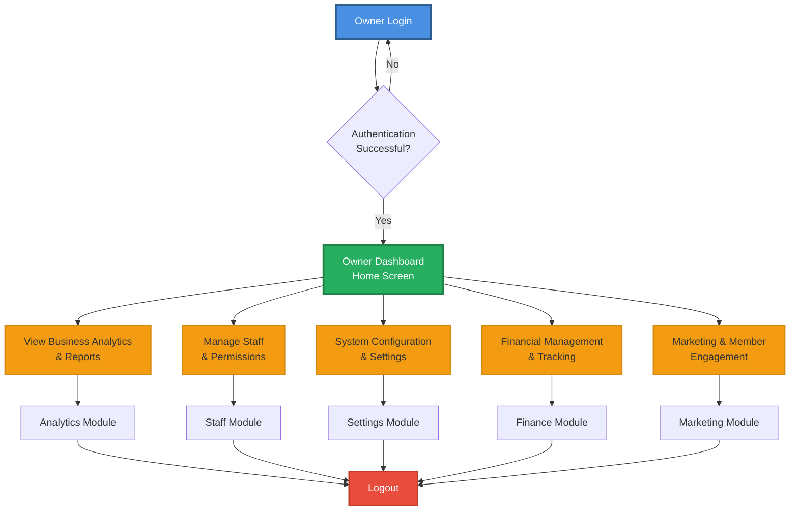

#### 4.1.2 Owner Analytics & Reports Workflow

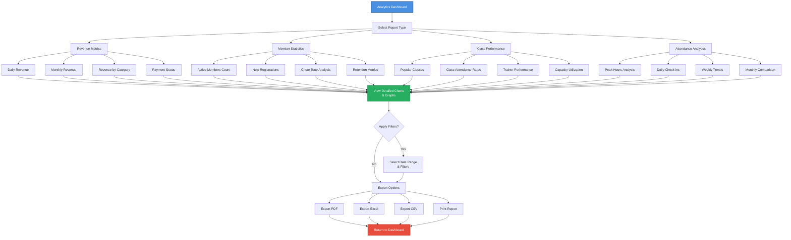

#### 4.1.3 Owner Staff Management Workflow

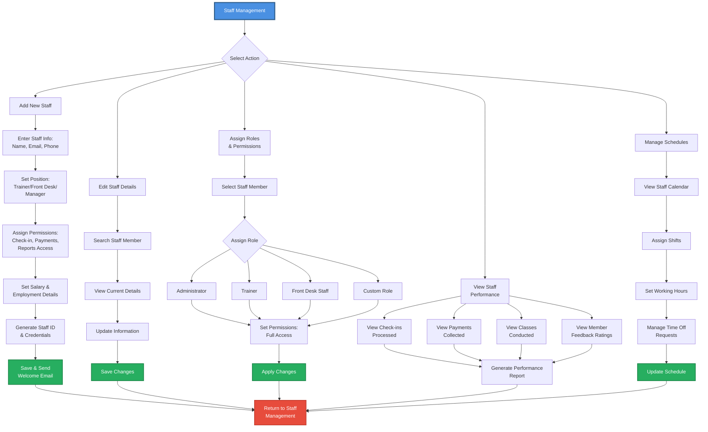

#### 4.1.4 Owner Financial Management Workflow

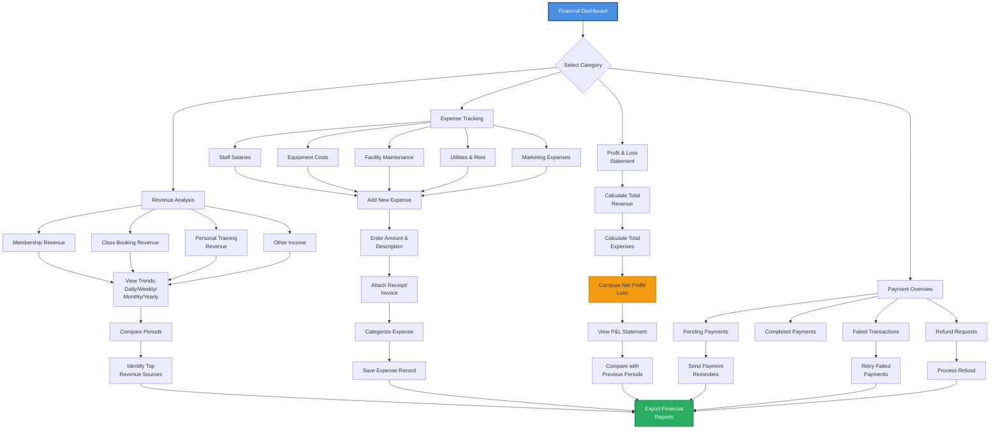

#### 4.1.5 Owner System Configuration Workflow

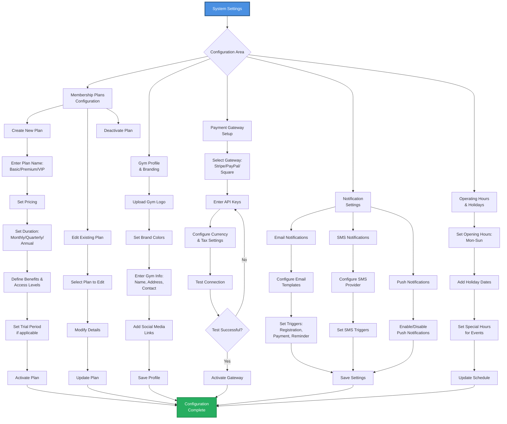

### 4.2 Staff Workflow

> [!NOTE]
> The Staff workflow has been split into multiple focused diagrams for better readability and detail.

#### 4.2.1 Staff Dashboard Overview

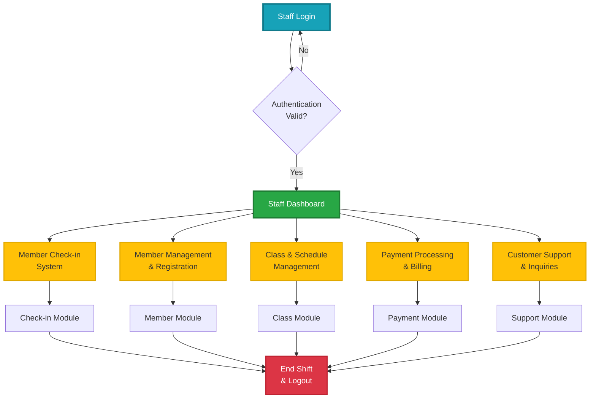

#### 4.2.2 Staff Member Check-in Workflow

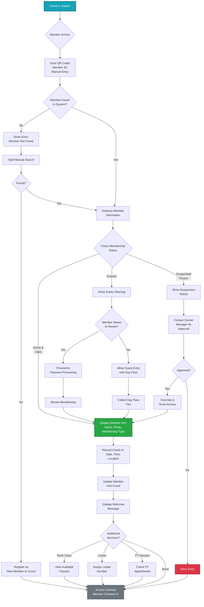

#### 4.2.3 Staff New Member Registration Workflow

```mermaid
graph TD
    START[New Member<br/>Registration] --> A[Greet Customer &<br/>Explain Options]
    
    A --> B[Open Registration<br/>Form]
    
    B --> C1[Collect Personal Info]
    
    C1 --> C2[Enter First Name &<br/>Last Name]
    C2 --> C3[Enter Email Address]
    C3 --> C4[Enter Phone Number]
    C4 --> C5[Enter Date of Birth]
    C5 --> C6[Enter Address]
    C6 --> C7[Emergency Contact<br/>Information]
    
    C7 --> D[Take Member Photo<br/>or Upload]
    
    D --> E[Display Available<br/>Membership Plans]
    
    E --> E1{Customer Selects<br/>Plan}
    
    E1 --> F1[Basic Plan<br/>$29/month]
    E1 --> F2[Premium Plan<br/>$49/month]
    E1 --> F3[VIP Plan<br/>$79/month]
    E1 --> F4[Day Pass<br/>$15]
    
    F1 --> G[Review Plan Details<br/>& Benefits]
    F2 --> G
    F3 --> G
    F4 --> G
    
    G --> H{Customer<br/>Confirms?}
    
    H -->|No| E
    H -->|Yes| I[Calculate Total<br/>Amount Including<br/>Tax & Fees]
    
    I --> J[Proceed to<br/>Payment]
    
    J --> K{Select Payment<br/>Method}
    
    K --> L1[Cash]
    K --> L2[Credit/Debit Card]
    K --> L3[Digital Wallet]
    K --> L4[Bank Transfer]
    
    L1 --> M[Process Payment]
    L2 --> M
    L3 --> M
    L4 --> M
    
    M --> N{Payment<br/>Successful?}
    
    N -->|No| O[Show Error &<br/>Retry]
    O --> K
    
    N -->|Yes| P[Generate Member ID<br/>& QR Code]
    
    P --> Q[Create Digital<br/>Membership Card]
    
    Q --> R[Print Receipt &<br/>Membership Card]
    
    R --> S[Send Welcome Email<br/>with Login<br/>Credentials]
    
    S --> T[Add to CRM<br/>Database]
    
    T --> U[Set up Auto-renew<br/>if Requested]
    
    U --> V[Provide Welcome Kit:<br/>Gym Rules,<br/>Class Schedule,<br/>Facility Tour Info]
    
    V --> W[Log Activity in<br/>System]
    
    W --> END[Registration<br/>Complete]
    
    style START fill:#17A2B8,stroke:#117A8B,stroke-width:3px,color:#fff
    style M fill:#FFC107,stroke:#E0A800,stroke-width:2px
    style P fill:#28A745,stroke:#1E7E34,stroke-width:2px,color:#fff
    style END fill:#28A745,stroke:#1E7E34,stroke-width:3px,color:#fff
```

#### 4.2.4 Staff Payment Processing Workflow

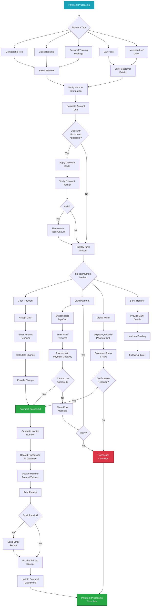

### 4.3 Customer Workflow

> [!NOTE]
> The Customer workflow has been split into multiple focused diagrams for better readability and detail.

#### 4.3.1 Customer Onboarding & Portal Access

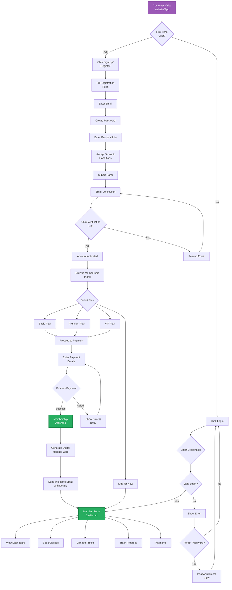

#### 4.3.2 Customer Dashboard & Information View

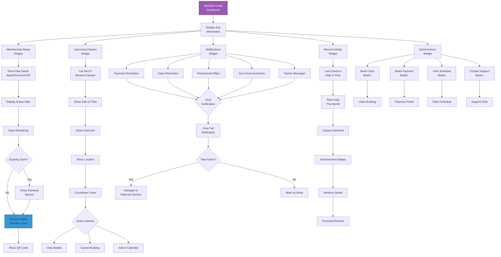

#### 4.3.3 Customer Class Booking Workflow

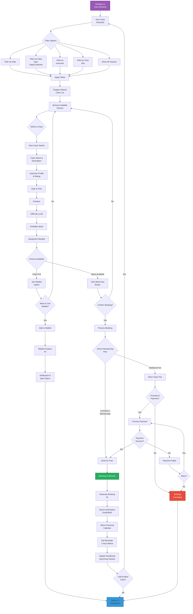

#### 4.3.4 Customer Profile Management Workflow

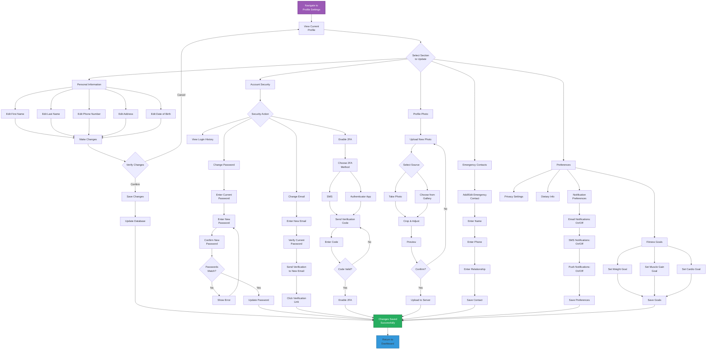

#### 4.3.5 Customer Payment & Billing Workflow

```mermaid
graph TD
    START[Navigate to<br/>Payments Section] --> A[Payment Dashboard]
    
    A --> B{Select Action}
    
    B --> C1[View Invoices]
    B --> C2[Make Payment]
    B --> C3[Setup Auto-pay]
    B --> C4[View Payment<br/>History]
    B --> C5[Update Payment<br/>Method]
    
    C1 --> D1[Display Invoice<br/>List]
    D1 --> D2{Filter Invoices}
    D2 --> D3[All Invoices]
    D2 --> D4[Paid]
    D2 --> D5[Unpaid]
    D2 --> D6[Overdue]
    
    D3 --> E[Show Filtered<br/>Invoices]
    D4 --> E
    D5 --> E
    D6 --> E
    
    E --> F{Select Invoice}
    F --> G[View Invoice<br/>Details]
    G --> G1[Invoice Number]
    G1 --> G2[Amount]
    G2 --> G3[Due Date]
    G3 --> G4[Description]
    G4 --> G5[Download PDF]
    G5 --> H{Pay This<br/>Invoice?}
    H -->|Yes| C2
    H -->|No| A
    
    C2 --> I[Select Amount<br/>to Pay]
    I --> J{Payment Type}
    J --> J1[Full Amount]
    J --> J2[Partial Payment]
    J --> <br/>Day Pass]
    J --> J4[Class Booking]
    
    J1 --> K[Display Total<br/>Amount]
    J2 --> K
    J3 --> K
    J4 --> K
    
    K --> L{Apply Promo<br/>Code?}
    L -->|Yes| M1[Enter Code]
    M1 --> M2{Valid?}
    M2 -->|Yes| M3[Apply Discount]
    M2 -->|No| M4[Show Error]
    M4 --> L
    M3 --> N
    L -->|No| N
    
    N[Proceed to<br/>Checkout] --> O{Select Payment<br/>Method}
    
    O --> P1[Credit Card<br/>Saved]
    O --> P2[Debit Card<br/>Saved]
    O --> P3[Add New Card]
    O --> P4[Digital Wallet]
    O --> P5[Bank Transfer]
    
    P1 --> Q[Review Order]
    P2 --> Q
    
    P3 --> R1[Enter Card<br/>Number]
    R1 --> R2[Enter Expiry &<br/>CVV]
    R2 --> R3[Enter Billing<br/>Address]
    R3 --> R4{Save for<br/>Future?}
    R4 -->|Yes| R5[Save Card<br/>Details]
    R4 -->|No| Q
    R5 --> Q
    
    P4 --> S1[Select Wallet:<br/>PayPal/Apple/<br/>Google Pay]
    S1 --> S2[Redirect to<br/>Wallet]
    S2 --> Q
    
    P5 --> T1[Display Bank<br/>Account Info]
    T1 --> T2[Generate Payment<br/>Reference]
    T2 --> T3[Mark Pending<br/>Verification]
    
    Q --> U{Confirm<br/>Payment?}
    U -->|No| CANCEL
    U -->|Yes| V[Process<br/>Transaction]
    
    V --> W{Transaction<br/>Successful?}
    
    W -->|No| X[Payment Failed]
    X --> Y[Show Error<br/>Reason]
    Y --> Z{Retry?}
    Z -->|Yes| O
    Z -->|No| CANCEL
    
    W -->|Yes| AA[Payment<br/>Successful]
    
    AA --> AB[Generate Receipt]
    AB --> AC[Send Email<br/>Confirmation]
    AC --> AD[Update Account<br/>Balance]
    AD --> AE[Update Invoice<br/>Status to Paid]
    AE --> AF{Download<br/>Receipt?}
    AF -->|Yes| AG[Download PDF]
    AF -->|No| AH
    AG --> AH[Display Success<br/>Message]
    
    C3 --> AI[Setup Auto-pay]
    AI --> AJ[Select Payment<br/>Method]
    AJ --> AK[Choose Billing<br/>Cycle]
    AK --> AL[Set Payment Date]
    AL --> AM{Enable<br/>Auto-pay?}
    AM -->|Yes| AN[Save Settings]
    AM -->|No| CANCEL
    AN --> SUCCESS
    
    C4 --> AO[Display Payment<br/>History]
    AO --> AP[Show Transaction<br/>List]
    AP --> AQ{Export Data?}
    AQ -->|Yes| AR[Download Excel/<br/>PDF]
    AQ -->|No| A
    AR --> A
    
    C5 --> AS[Manage Payment<br/>Methods]
    AS --> AT{Action}
    AT --> AU[Add New Method]
    AT --> AV[Edit Existing]
    AT --> AW[Delete Method]
    AT --> AX[Set Default]
    
    AU --> AY[Enter Payment<br/>Details]
    AY --> AZ[Save Method]
    AZ --> SUCCESS
    
    AV --> BA[Update Details]
    BA --> SUCCESS
    
    AW --> BB{Confirm<br/>Deletion?}
    BB -->|Yes| BC[Remove Method]
    BB -->|No| AS
    BC --> SUCCESS
    
    AX --> BD[Set as Default<br/>Payment]
    BD --> SUCCESS
    
    T3 --> SUCCESS
    AH --> SUCCESS
    
    SUCCESS[Action<br/>Completed] --> END[Return to<br/>Dashboard]
    CANCEL[Action<br/>Cancelled] --> END
    
    style START fill:#9B59B6,stroke:#7D3C98,stroke-width:3px,color:#fff
    style AA fill:#27AE60,stroke:#1E8449,stroke-width:2px,color:#fff
    style SUCCESS fill:#27AE60,stroke:#1E8449,stroke-width:2px,color:#fff
    style END fill:#3498DB,stroke:#2874A6,stroke-width:2px
    style CANCEL fill:#E74C3C,stroke:#C0392B,stroke-width:2px,color:#fff
    style X fill:#E74C3C,stroke:#C0392B,stroke-width:2px,color:#fff
```

---

## 5. Detailed Feature Interactions

### 5.1 Member Registration Flow (Customer → Staff)

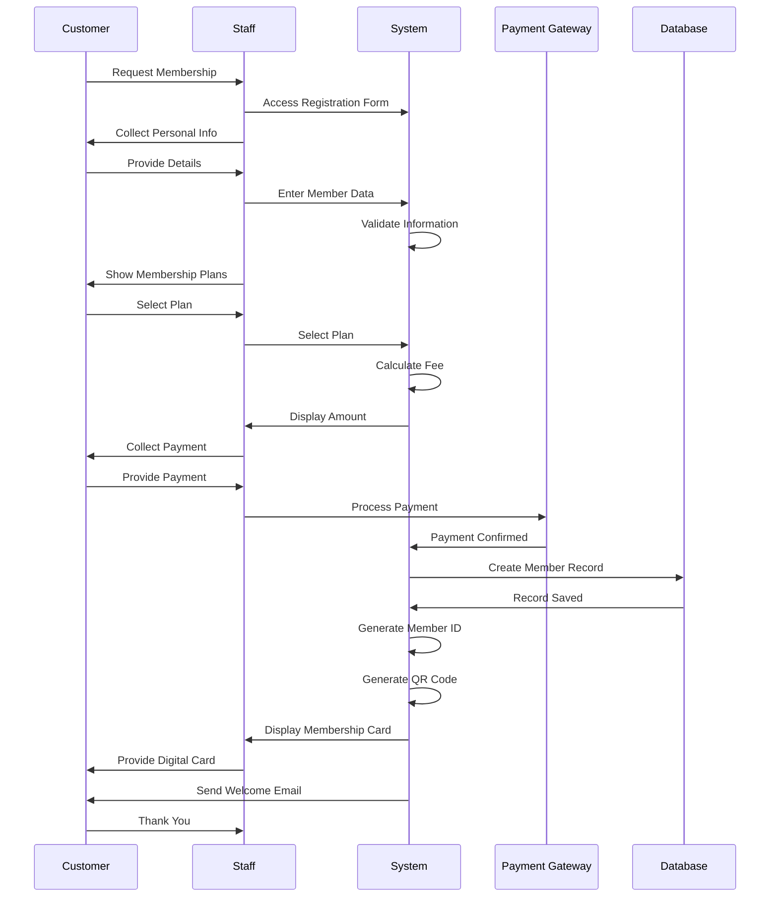

### 5.2 Class Booking Flow (Customer Self-Service)

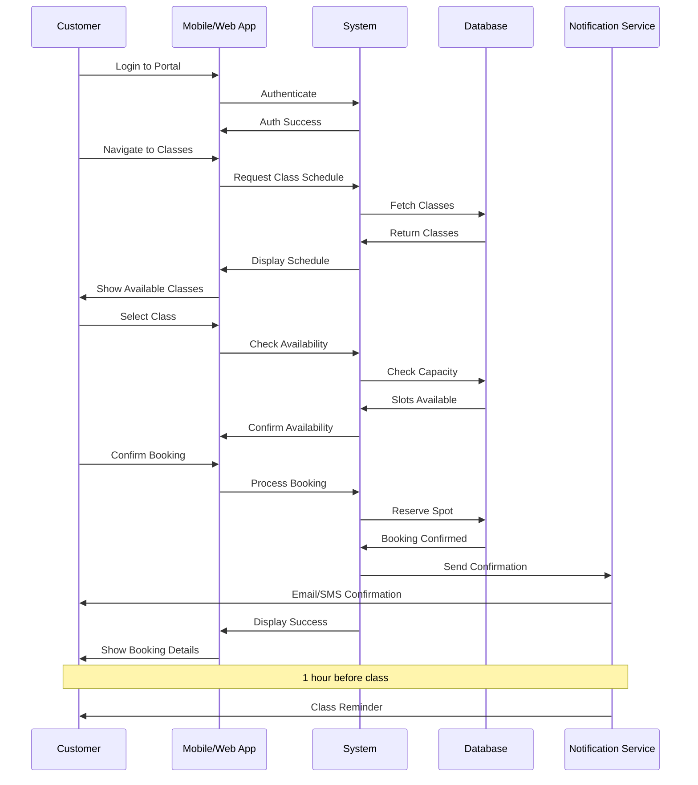

### 5.3 Daily Check-in Flow (Customer → Staff)

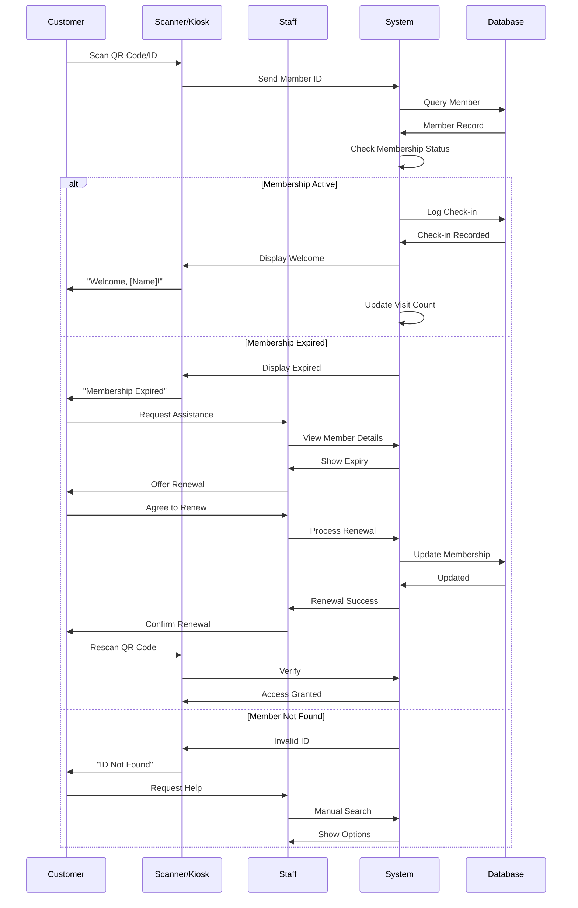

### 5.4 Owner Analytics Review Flow

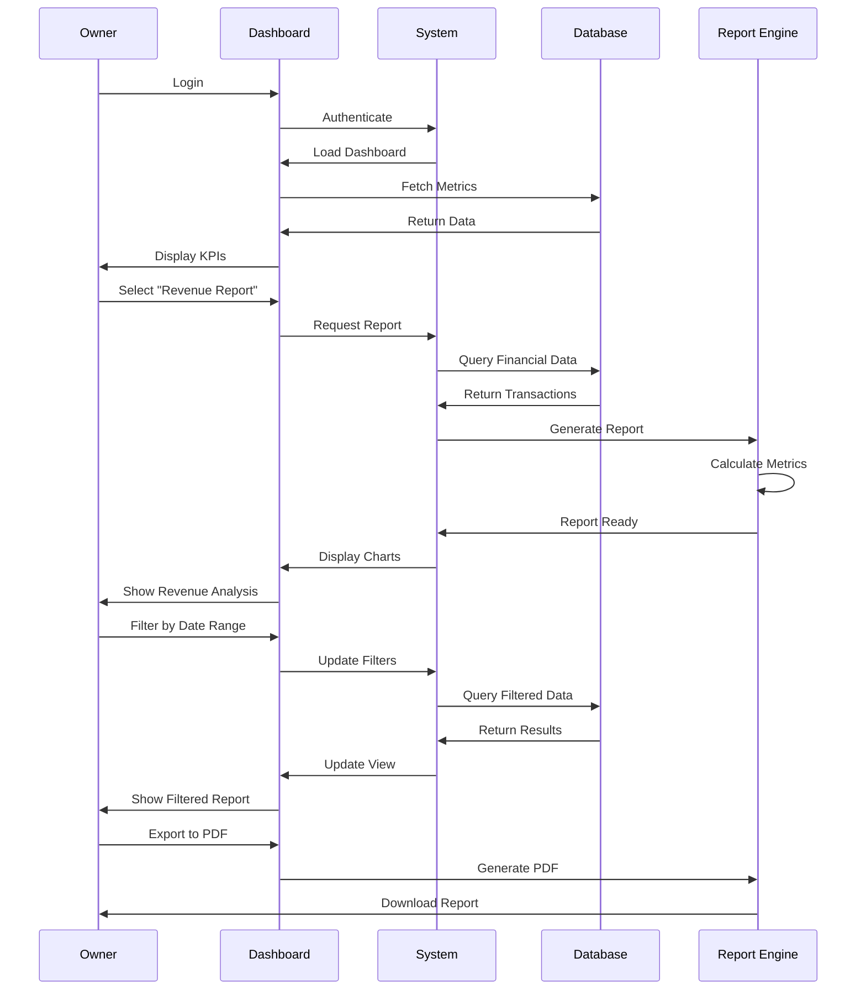

---

## 6. Non-Functional Requirements

### 6.1 Performance
- **Response Time**: Page loads within 2 seconds
- **Concurrent Users**: Support 500+ simultaneous users
- **Database**: Handle 100,000+ member records
- **Uptime**: 99.9% availability

### 6.2 Security
- **Authentication**: Multi-factor authentication for owners
- **Data Encryption**: SSL/TLS for data in transit, AES-256 for data at rest
- **Role-Based Access Control (RBAC)**: Strict permission management
- **Payment Security**: PCI DSS compliance
- **Data Backup**: Daily automated backups with 30-day retention
- **Session Management**: Auto-logout after 30 minutes of inactivity

### 6.3 Usability
- **Intuitive UI**: Minimal training required (< 1 hour)
- **Mobile Responsive**: Work on all devices (desktop, tablet, mobile)
- **Accessibility**: WCAG 2.1 Level AA compliance
- **Multi-language Support**: English (initial), expandable

### 6.4 Scalability
- **Horizontal Scaling**: Cloud-based infrastructure
- **Database**: Optimized queries and indexing
- **Caching**: Redis for frequently accessed data
- **Load Balancing**: Distribute traffic efficiently

### 6.5 Reliability
- **Error Handling**: Graceful error messages
- **Data Integrity**: Transaction management and validation
  - Oracle ACID compliance for all transactions
  - Referential integrity constraints
  - Triggers for business rule enforcement
- **Disaster Recovery**: Backup and restore procedures
  - Oracle RMAN (Recovery Manager) for automated backups
  - Point-in-time recovery capabilities
  - Oracle Data Guard for standby database
- **Monitoring**: Real-time system health monitoring
  - Oracle Enterprise Manager Cloud Control
  - Automated alerts for performance degradation

### 6.6 Compatibility
- **Browsers**: Chrome, Firefox, Safari, Edge (latest 2 versions)
- **Operating Systems**: Windows, macOS, Linux, iOS, Android
- **Payment Gateways**: Stripe, PayPal, Square
- **Third-party Integrations**: Email (SendGrid), SMS (Twilio)

---

## 7. Technical Architecture

### 7.1 System Architecture

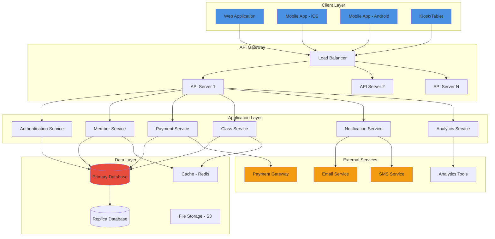

### 7.2 Technology Stack Recommendations

#### Frontend
- **Web**: React.js / Vue.js / Angular
- **Mobile**: React Native / Flutter
- **State Management**: Redux / Vuex / MobX
- **UI Framework**: Material-UI / Ant Design / Tailwind CSS

#### Backend
- **API**: Node.js (Express) / Python (Django/Flask) / Java (Spring Boot)
- **Authentication**: JWT / OAuth 2.0
- **API Documentation**: Swagger / OpenAPI

#### Database
- **Primary**: Oracle Database
- **Cache**: Redis
- **Search**: Elasticsearch (optional)

> [!IMPORTANT]
> **Oracle Database Configuration**
> - Utilize Oracle's built-in features for high availability (RAC - Real Application Clusters)
> - Leverage Oracle Advanced Security for encryption and data masking
> - Use Oracle Partitioning for efficient data management as the database grows
> - Implement Oracle Data Guard for disaster recovery and standby databases

#### DevOps
- **Hosting**: AWS / Google Cloud / Azure
- **CI/CD**: GitHub Actions / GitLab CI / Jenkins
- **Monitoring**: Prometheus + Grafana / New Relic / Datadog
- **Logging**: ELK Stack (Elasticsearch, Logstash, Kibana)

#### Third-party Services
- **Payment**: Stripe / PayPal / Square
- **Email**: SendGrid / AWS SES
- **SMS**: Twilio / AWS SNS
- **Storage**: AWS S3 / Google Cloud Storage

---

## 8. Data Model Overview

### 8.1 Core Entities

```mermaid
erDiagram
    USER ||--o{ MEMBER : "can be"
    USER ||--o{ STAFF : "can be"
    USER ||--|| OWNER : "can be"
    
    MEMBER ||--|| MEMBERSHIP : "has"
    MEMBER ||--o{ CHECKIN : "makes"
    MEMBER ||--o{ BOOKING : "creates"
    MEMBER ||--o{ PAYMENT : "makes"
    MEMBER ||--o{ PROGRESS : "tracks"
    
    MEMBERSHIP ||--|| PLAN : "based on"
    
    STAFF ||--o{ CHECKIN : "processes"
    STAFF ||--o{ PAYMENT : "receives"
    STAFF ||--|| CLASS : "instructs"
    
    CLASS ||--o{ BOOKING : "has"
    CLASS ||--|| SCHEDULE : "follows"
    
    OWNER ||--o{ REPORT : "views"
    OWNER ||--o{ STAFF : "manages"
    OWNER ||--o{ PLAN : "configures"
    
    USER {
        int user_id
        string email
        string password_hash
        string role
        timestamp created_at
    }
    
    MEMBER {
        int member_id
        int user_id
        string first_name
        string last_name
        string phone
        date date_of_birth
        string photo_url
        string qr_code
        string status
    }
    
    MEMBERSHIP {
        int membership_id
        int member_id
        int plan_id
        date start_date
        date end_date
        string status
        boolean auto_renew
    }
    
    PLAN {
        int plan_id
        string name
        decimal price
        int duration_months
        string benefits
        boolean active
    }
    
    CHECKIN {
        int checkin_id
        int member_id
        int staff_id
        timestamp checkin_time
        string location
    }
    
    CLASS {
        int class_id
        string name
        string description
        int instructor_id
        int capacity
        int duration_minutes
    }
    
    SCHEDULE {
        int schedule_id
        int class_id
        timestamp start_time
        timestamp end_time
        string day_of_week
    }
    
    BOOKING {
        int booking_id
        int member_id
        int schedule_id
        string status
        timestamp booked_at
    }
    
    PAYMENT {
        int payment_id
        int member_id
        int staff_id
        decimal amount
        string payment_method
        string status
        timestamp payment_date
        string invoice_number
    }
```

---

## 9. User Interface Guidelines

### 9.1 Design Principles
- **Simplicity**: Clean, uncluttered interface
- **Consistency**: Uniform design language across all modules
- **Responsiveness**: Mobile-first approach
- **Accessibility**: High contrast, large touch targets, screen reader support
- **Feedback**: Clear success/error messages

### 9.2 Color Scheme (Suggested)
- **Primary**: Blue (#4A90E2) - Trust, professionalism
- **Secondary**: Green (#27AE60) - Success, growth
- **Accent**: Orange (#F39C12) - Energy, action
- **Error**: Red (#E74C3C) - Warnings, alerts
- **Neutral**: Gray (#95A5A6) - Text, backgrounds

### 9.3 Key Screen Templates

#### Owner Dashboard
- Top: KPI cards (Revenue, Active Members, Classes Today, Attendance Rate)
- Left: Navigation menu
- Center: Charts and graphs (revenue trends, member growth)
- Right: Recent activities, alerts

#### Staff Dashboard
- Quick actions: Check-in, New Member, Process Payment
- Today's schedule
- Pending tasks
- Recent check-ins

#### Customer Portal
- Membership card (prominent display)
- Upcoming classes
- Quick book button
- Progress summary
- Notifications

---

## 10. Success Metrics

### 10.1 Business Metrics
- **Adoption Rate**: 80% of members use the system within 3 months
- **Customer Satisfaction**: NPS score > 50
- **Operational Efficiency**: 60% reduction in administrative time
- **Revenue Growth**: 20% increase in membership sales
- **Retention Rate**: 85% annual member retention

### 10.2 Technical Metrics
- **System Uptime**: 99.9%
- **Average Response Time**: < 2 seconds
- **Bug Resolution Time**: Critical bugs < 4 hours, others < 48 hours
- **User Adoption**: 75% monthly active users

---

## 11. Implementation Phases

### Phase 1: MVP (Months 1-3)
**Owner:**
- Basic dashboard with key metrics
- Staff management
- Membership plan configuration

**Staff:**
- Member registration
- Check-in system
- Basic payment processing

**Customer:**
- Registration
- Member portal
- View membership status

### Phase 2: Core Features (Months 4-6)
**Owner:**
- Advanced analytics
- Financial reporting
- Marketing tools

**Staff:**
- Class management
- Advanced payment features
- Customer support tools

**Customer:**
- Class booking
- Payment management
- Profile management

### Phase 3: Advanced Features (Months 7-9)
**Owner:**
- Predictive analytics
- Custom reports
- Multi-location support

**Staff:**
- Personal training management
- Inventory management

**Customer:**
- Progress tracking
- Goal setting
- Social features

### Phase 4: Optimization (Months 10-12)
- Mobile apps (iOS/Android)
- Integration with wearables
- AI-powered recommendations
- Advanced automation

---

## 12. Risk Assessment

| Risk | Impact | Likelihood | Mitigation Strategy |
|------|--------|------------|---------------------|
| Payment gateway failures | High | Medium | Multiple payment options, fallback mechanisms |
| Data breach | Critical | Low | Strong encryption, regular security audits, compliance |
| Poor user adoption | High | Medium | Intuitive UI, comprehensive training, support |
| System downtime | High | Low | Redundant infrastructure, monitoring, quick recovery |
| Scope creep | Medium | High | Clear requirements, phased approach, change management |
| Integration issues | Medium | Medium | API-first design, thorough testing |

---

## 13. Compliance & Legal

### 13.1 Data Protection
- **GDPR Compliance**: For European customers
- **Data Privacy**: Clear privacy policy and terms of service
- **User Consent**: Explicit consent for data collection
- **Right to Delete**: Allow users to request data deletion

### 13.2 Payment Compliance
- **PCI DSS**: For handling credit card information
- **Financial Reporting**: Accurate and auditable transactions

### 13.3 Health & Safety
- **Medical Waivers**: Digital consent forms
- **Emergency Contacts**: Required field for all members
- **Liability Waivers**: Digital signatures

---

## 14. Support & Maintenance

### 14.1 Customer Support
- **Help Center**: Comprehensive documentation and FAQs
- **Live Chat**: During business hours
- **Email Support**: 24-hour response time
- **Phone Support**: For critical issues

### 14.2 System Maintenance
- **Regular Updates**: Monthly feature updates
- **Security Patches**: Immediate deployment
- **Database Optimization**: Quarterly
  - Oracle AWR (Automatic Workload Repository) analysis
  - Index optimization and rebuilding
  - Table space management
  - Execution plan reviews
- **Performance Monitoring**: Continuous
  - Oracle Enterprise Manager for database monitoring
  - Real-time performance dashboards

---

## 15. Appendix

### 15.1 Glossary
- **Check-in**: Process of recording member entry to the gym
- **Membership Freeze**: Temporary suspension of membership
- **Waitlist**: Queue for fully booked classes
- **QR Code**: Quick Response code for member identification
- **KPI**: Key Performance Indicator

### 15.2 References
- Industry best practices for gym management
- UX/UI design guidelines
- Security compliance standards
- Payment processing regulations

---

## 16. Approval & Sign-off

| Role | Name | Signature | Date |
|------|------|-----------|------|
| Product Owner | | | |
| Technical Lead | | | |
| UX Designer | | | |
| Stakeholder | | | |

---

**Document End**

> [!NOTE]
> This PRD is a living document and will be updated as requirements evolve and new insights are gained during development.
